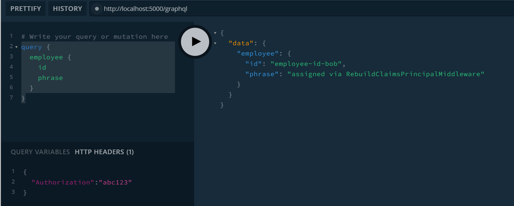

## Using a Custom `ClaimsPrincipal`

This example shows a method to to preserve a custom claims principal, injected into the HttpPipeline, all the way through to a `GraphController`.


## How to Execute a Query

This example mocks an authentication handler for ease of use. To authorize a user account, supply an `Authorization` header on your request with a valid user token. 

### Valid User Tokens:
```
"abc123"
"xyx456"
```


### Sample Query:
```graphql
query {
  employee {
    id
    phrase
  }
}
```

## Results

